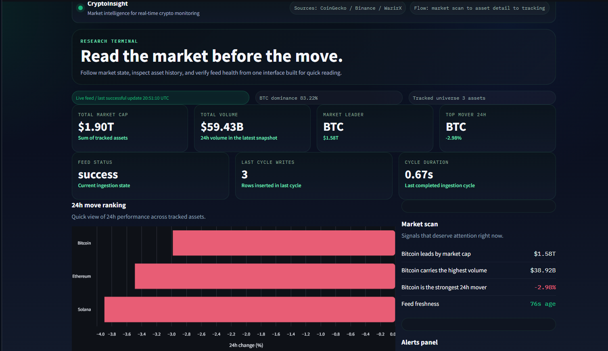
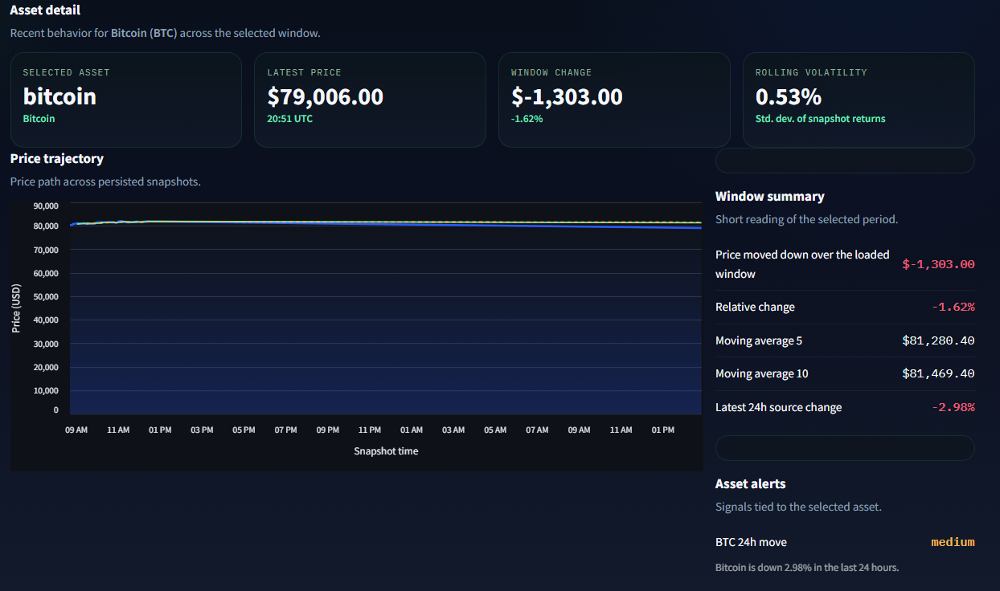
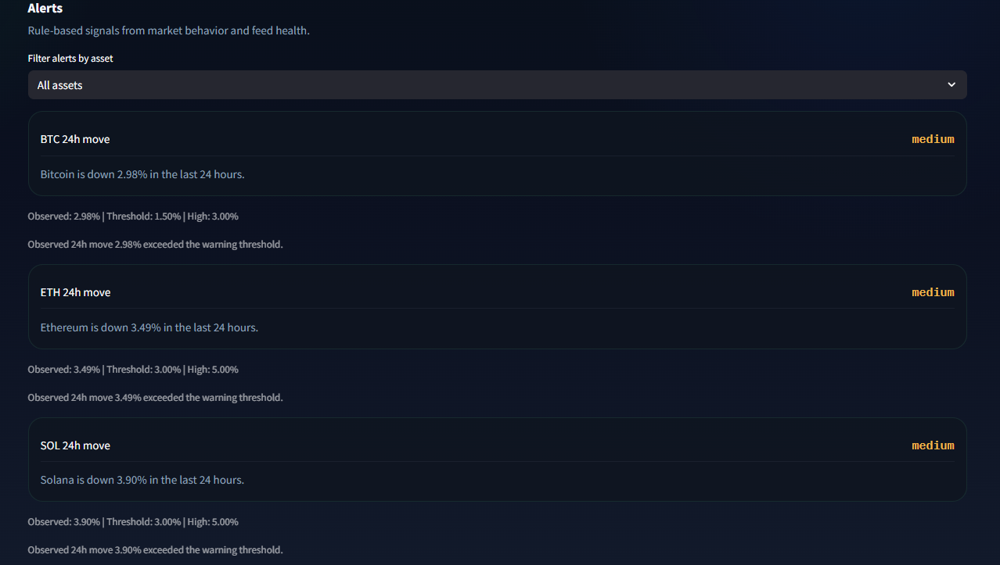
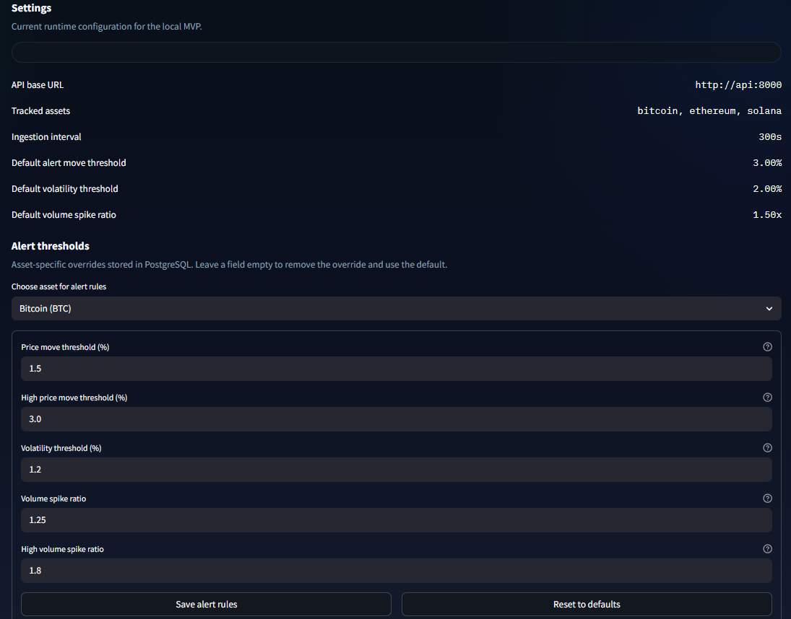

# CryptoInsight

> Replace `OWNER/REPO` after publishing this project to GitHub.
>
> 

CryptoInsight is a market intelligence MVP for crypto monitoring. It ingests public market data, stores historical snapshots in PostgreSQL, exposes a FastAPI backend, and renders an operational dashboard in Streamlit.

The project is built to answer three questions:
- What is happening in the market right now
- What is happening with a specific asset
- Is the data pipeline healthy enough to trust the screen

## Screenshots

### Overview

Shows the main operating surface: market status, KPIs, feed health, and the current market scan.



### Asset detail

Shows the selected asset window, historical price path, and derived analytics such as change and rolling volatility.



### Alerts

Shows rule-based signals with observed values, thresholds, and short severity explanations.



### Settings

Shows runtime configuration and per-asset alert threshold overrides stored in PostgreSQL.



## Why this project exists

Many crypto dashboard projects cover only the fetch-and-display layer. This one adds historical storage, backend contracts, alerting, observability, and a dashboard organized around market reading rather than raw output.

## What it does today

- Fetches market data from CoinGecko
- Persists immutable historical snapshots in PostgreSQL
- Runs ingestion, API, migration, and dashboard services through Docker Compose
- Exposes current market, historical data, watchlist, health, and alert endpoints
- Tracks ingestion status for operational visibility
- Supports persistent watchlists
- Supports per-asset alert rule overrides
- Explains why each alert fired with observed values and thresholds
- Runs automated tests locally and in GitHub Actions

## Architecture

```text
CoinGecko API
    |
    v
Ingestion worker
    |
    v
PostgreSQL
    |
    +--> FastAPI service
    |
    +--> Streamlit dashboard
```

## Stack

- Backend: FastAPI, SQLAlchemy, Alembic
- Database: PostgreSQL
- Dashboard: Streamlit, Altair, Pandas
- Ingestion: Python worker with retry and backoff
- Testing: Pytest
- CI: GitHub Actions
- Containerization: Docker Compose

## Product flow

The UI follows this path:

`market scan -> asset detail -> tracking`

Main views:
- `Overview`
- `Markets`
- `Watchlist`
- `Alerts`
- `Assets`
- `Settings`

## Key design decisions

### Separate ingestion from the API

The API is optimized for reads, while ingestion is responsible for external fetches and writes. This keeps failures, retries, and timing concerns out of request handling.

### Store immutable snapshots

Historical snapshots make analytics and alerting simpler. They preserve the state of the market at a point in time, which is more useful here than overwriting a single current-price row.

### Keep the dashboard behind the API

The dashboard talks to FastAPI instead of PostgreSQL directly. That keeps the presentation layer aligned with an API contract instead of the storage model.

### Treat observability as product data

Feed freshness, ingestion duration, rows fetched, rows inserted, and last error are visible through the API and the dashboard. That makes the interface easier to trust.

## Repository layout

```text
.
|-- alembic/
|   `-- versions/
|-- app/
|   |-- api/
|   |-- core/
|   |-- db/
|   |-- ingestion/
|   |-- schemas/
|   |-- services/
|   `-- main.py
|-- dashboard/
|   |-- api_client.py
|   |-- formatters.py
|   |-- streamlit_app.py
|   |-- ui.py
|   `-- views.py
|-- scripts/
|-- tests/
|-- .github/workflows/
|-- .env.example
|-- docker-compose.yml
|-- Dockerfile.app
|-- Dockerfile.dashboard
`-- requirements.txt
```

## Local setup

1. Copy `.env.example` to `.env`
2. Start the stack

```bash
docker compose up --build
```

3. Open:
- API docs: `http://localhost:8000/docs`
- Dashboard: `http://localhost:8501`

## Services

- `postgres`: database
- `migrate`: applies Alembic migrations before app services start
- `api`: FastAPI application
- `ingestion`: periodic market data ingestion worker
- `dashboard`: Streamlit UI

## API surface

### Health and market data

- `GET /api/v1/health`
- `GET /api/v1/market/latest`
- `GET /api/v1/market/summary`
- `GET /api/v1/market/history/{asset_id}`
- `GET /api/v1/market/alerts`
- `GET /api/v1/market/alerts?asset_id=bitcoin`

### User-facing product state

- `GET /api/v1/market/watchlist`
- `PUT /api/v1/market/watchlist`
- `GET /api/v1/market/alert-rules/{asset_id}`
- `PUT /api/v1/market/alert-rules/{asset_id}`

## Historical analytics

The asset history endpoint supports:
- `limit`
- `start_at`
- `end_at`

It also returns derived metrics for the selected window:
- latest price
- window change in USD
- window change in percent
- moving average over 5 points
- moving average over 10 points
- rolling volatility
- highest price
- lowest price

Example:

```bash
curl "http://localhost:8000/api/v1/market/history/bitcoin?limit=50"
```

```bash
curl "http://localhost:8000/api/v1/market/history/bitcoin?start_at=2026-05-13T23:00:00Z&end_at=2026-05-14T01:00:00Z&limit=100"
```

## Alerting model

The current alerting layer is rule-based. It covers:
- 24h price moves
- rolling volatility
- volume spikes against a recent baseline
- ingestion failures
- slow ingestion cycles
- feed lag

Per-asset thresholds can be overridden through the dashboard or the alert-rules API.

Current configurable keys:
- `price_move_pct`
- `price_move_high_pct`
- `volatility_pct`
- `volume_spike_ratio`
- `volume_spike_high_ratio`

Each alert also returns:
- observed value
- threshold value
- high threshold value, when relevant
- unit
- short reason for the assigned severity

## Observability

The health response exposes pipeline status when available:
- source
- status
- last attempt timestamp
- last success timestamp
- last error
- last duration in seconds
- rows fetched
- rows inserted

That same operational context is surfaced in the dashboard.

## Testing

Tests live under `tests/`.

Local:

```bash
pytest -q
```

Containerized:

```bash
docker compose run --rm api pytest -q
```

CI:
- GitHub Actions runs tests on push and pull request
- The workflow also compiles and imports key Python modules as a smoke check

## Current limitations

- CoinGecko is the only live source currently wired into ingestion
- Watchlist is shared for the local MVP, not user-specific
- Alerting is rule-based, not predictive
- Streamlit is fast to iterate on, although it offers less control than a dedicated frontend

## What I would build next

- Real multi-source ingestion across Binance and WazirX
- Asset comparison views
- More explicit alert source and category filters
- Notification delivery, not just on-screen signals
- A React frontend if the product needs deeper interaction

## Project status

The current build already covers:
- ingestion
- persistence
- API contracts
- dashboard views
- alerting
- observability
- persistent product state
- automated tests

That scope is enough to discuss architecture, data flow, backend contracts, and product tradeoffs from a real implementation.
